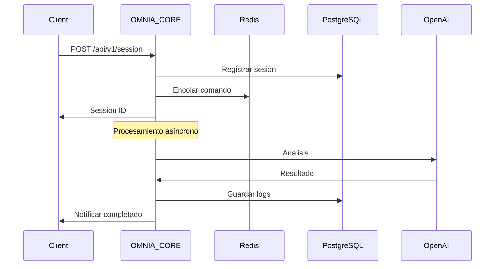

# OMNIA MVP v1.0 - Especificaciones Técnicas

## Visión General
MVP (Minimum Viable Product) que establece la base del sistema OMNIA con el CORE funcional y la infraestructura mínima para desarrollo modular.

## Arquitectura v1.0

### 🏗️ Componentes Principales

**1. OMNIA CORE (Orquestador Central)**
- **Función**: Autoridad central de control y coordinación
- **Responsabilidades**:
  - Recepción de instrucciones externas
  - Orquestación de módulos
  - Ruteo de mensajes
  - Telemetría y logging central
  - Gestión de políticas globales

**2. Infraestructura Base**
- **Base de Datos**: PostgreSQL (persistencia de configuración y logs)
- **Sistema de Colas**: Redis (coordinación asíncrona)
- **Plataforma**: n8n (workflows y orquestación visual)

### 📋 Módulos en MVP v1.0

#### OMNIA CORE (v1.0)
**Componentes Técnicos:**
- API REST para instrucciones externas
- Webhook endpoint para eventos
- Sistema de ruteo interno
- Logger centralizado con PostgreSQL
- Configurador de políticas básicas
- Health check y monitoreo básico

**Flujo de Datos:**
```
Entrada Externa → OMNIA CORE → Ruteo → Módulos
                      ↓
                  Logging → PostgreSQL
```

#### Infraestructura de Soporte
**PostgreSQL:**
- Tabla: `omnia_sessions` (sesiones activas)
- Tabla: `omnia_logs` (telemetría y errores)
- Tabla: `omnia_config` (configuraciones)
- Tabla: `omnia_queue` (cola de tareas)

**Redis:**
- Canal: `omnia_commands` (comandos)
- Canal: `omnia_results` (resultados)
- Canal: `omnia_health` (monitoreo)

### 🔗 APIs y Endpoints

**OMNIA CORE API (v1.0)**
```javascript
// Iniciar sesión
POST /api/v1/session
{
  "user_id": "string",
  "request_type": "analysis|ingestion|processing",
  "priority": "low|medium|high|critical",
  "payload": "object"
}

// Estado de sesión
GET /api/v1/session/{session_id}

// Webhook para resultados
POST /api/v1/webhook/result
{
  "session_id": "string",
  "module": "string",
  "result": "object",
  "status": "success|error"
}
```

### 🛠️ Stack Tecnológico

**Backend (n8n Workflows):**
- n8n Community Edition
- PostgreSQL (10+)
- Redis (6+)
- Node.js SDKs para APIs

**Integraciones Disponibles:**
- OpenAI GPT-4/3.5
- Anthropic Claude
- Google AI (Gemini)
- Serper (búsqueda)
- Web scraping y parsing

### 📊 Métricas v1.0

**Monitoreo Básico:**
- Latencia de respuesta por módulo
- Throughput (requests/min)
- Error rate por componente
- Uso de recursos Redis/PostgreSQL

**Targets:**
- Latencia: <500ms para comandos simples
- Uptime: >99.5%
- Error rate: <2%

### 🔄 Flujo de Trabajo v1.0

**Caso de Uso: Análisis de Texto**


### 🚀 Plan de Implementación

**Fase 1: Infraestructura (2-3 horas)**
1. Configurar PostgreSQL
2. Configurar Redis
3. Setup n8n básico
4. Conectar credenciales de APIs

**Fase 2: OMNIA CORE (2-3 horas)**
1. Workflow principal de orquestación
2. APIs REST en n8n
3. Sistema de logging
4. Health checks

**Fase 3: Testing y Validación (1-2 horas)**
1. Testing de APIs
2. Validación de flujos
3. Métricas básicas
4. Documentación de uso

### ✅ Criterios de Éxito

**Funcionalidad:**
- [ ] API de sesiones funcional
- [ ] Logging persistente en PostgreSQL
- [ ] Cola Redis operativa
- [ ] Telemetría básica funcionando

**Performance:**
- [ ] Latencia <500ms en requests simples
- [ ] Throughput mínimo 100 requests/min
- [ ] Uptime >99.5% durante testing

**Integración:**
- [ ] OpenAI API conectada
- [ ] Google AI conectada
- [ ] Anthropic API conectada
- [ ] Serper conectada

### 🔮 Próximos Pasos (v1.1)

Con la base v1.0 establecida, el siguiente paso será añadir:
- ENGINE CORE (coordinador de operaciones)
- Módulo ANCHOR (ingesta de datos)
- Integraciones más avanzadas

---

**Fecha de Creación**: 2025-11-06  
**Autor**: MiniMax Agent  
**Versión**: v1.0
